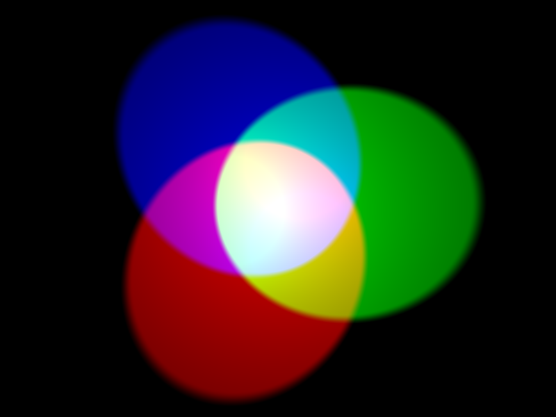

Barva objektu závisí na barvě světla, které odráží nebo vyzařuje. Světlo může mít různé vlnové délky a na ní právě barva světla závisí. Barva světla podle jeho vlnové délky je vidět na obrázku níže. Je to stejné jako s barvami duhy.

Barvu jsme schopni vidět díky speciálním buňkám v našich očích. Tyto buňky se nazývají *čípky*. Máme tři typy barvocitlivých buněk a každý typ detekuje buď červené, modré nebo zelené světlo. Všechny barvy, které vidíme, jsou tak směsí tvořenou barvami červená, modrá a zelená.

Při aditivním míchání barev se k vytvoření dalších barev používají tři barvy (červená, zelená a modrá). V obrázku výše můžeš vidět tři reflektory, které svítí stejným jasem, jeden pro každou barvu. Pokud barvy chybí, výsledek je černá. Pokud smícháme všechny tři barvy, výsledek je bílá. Zkombinováním červené a zelené vznikne žlutá. Zkombinováním červené a modré vznikne purpurová. Zkombinováním modré a zelené vznikne azurová. Změníš-li jas třech původních barev, můžeš jich vytvořit daleko více.

Počítače ukládají vše jako jedničky (1) a nuly (0). Tyto 1 a 0 jsou často uspořádány do sad po 8, které se nazývají **bajty**.

Jediný bajt může reprezentovat libovolné číslo od 0 do 255.

Když chceme v počítačovém programu reprezentovat barvu, můžeme to udělat tak, že definujeme poměr červené, modré a zelené barvy, z kterého se tato barva skládá. Tyto hodnoty se obvykle ukládají jako jeden byte, a tedy jako číslo v rozmezí 0 až 255.

Zde je tabulka znázorňující některé hodnoty barev:

| Červená | Zelená | Modrá | Barva     |
| ------- | ------ | ----- | --------- |
| 255     | 0      | 0     | Červená   |
| 0       | 255    | 0     | Zelená    |
| 0       | 0      | 255   | Modrá     |
| 255     | 255    | 0     | Žlutá     |
| 255     | 0      | 255   | Purpurová |
| 0       | 255    | 255   | Azurová   |

Pěkný nástroj pro [výběr a tvorbu barev najdeš na W3Schools](https://www.w3schools.com/colors/colors_rgb.asp){:target="_blank"}.