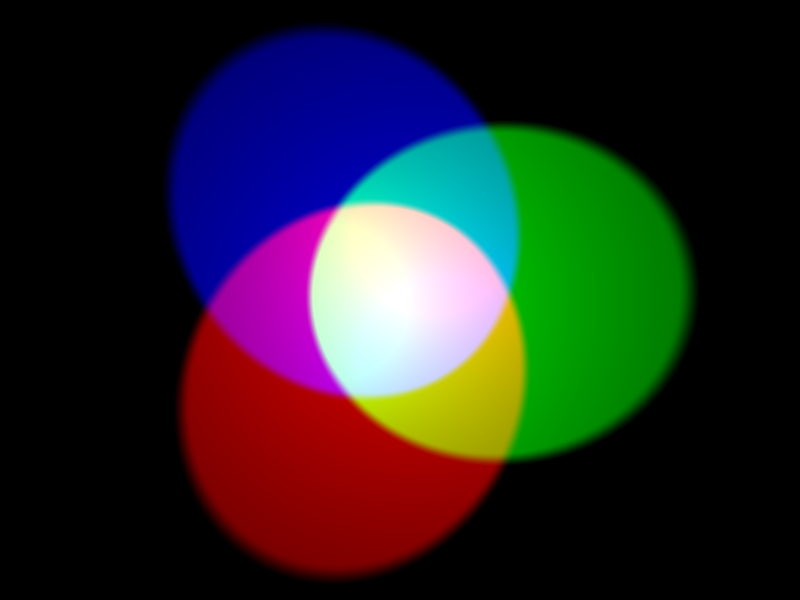

Die Farbe eines Objekts hängt von der Farbe des Lichts ab, das es reflektiert oder ausstrahlt. Licht kann verschiedene Wellenlängen haben, und die Farbe des Lichts hängt von der Wellenlänge ab, die es hat. Die Farbe des Lichts in Abhängigkeit von seiner Wellenlänge ist in der folgenden Abbildung zu sehen. Sie können dies als die Farben des Regenbogens erkennen.

Menschen sehen Farbe aufgrund spezieller Zellen in unseren Augen. Diese Zellen werden *Kegel*. Wir haben drei Arten von Kegelzellen und jeder Typ erkennt entweder rotes, blaues oder grünes Licht. Daher sind alle Farben, die wir sehen, nur Mischungen der Farben Rot, Blau und Grün.

Bei der additiven Farbmischung werden drei Farben (rot, grün und blau) verwendet, um andere Farben zu erzeugen. Im obigen Bild sind drei Scheinwerfer gleicher Helligkeit, einer für jede Farbe. Wenn keine Farbe vorhanden ist, ist das Ergebnis schwarz. Wenn alle drei Farben gemischt sind, ist das Ergebnis weiß. Wenn Rot und Grün kombiniert werden, ist das Ergebnis gelb. Wenn Rot und Blau kombiniert werden, ist das Ergebnis Magenta. Wenn Blau und Grün kombiniert werden, ist das Ergebnis Cyan. Es ist möglich, noch mehr Farben zu erzeugen, indem die Helligkeit der drei verwendeten Originalfarben variiert wird.

Computer speichern alles als 1s und 0s. Diese 1s und 0s sind oft in Gruppen von 8 organisiert, die **Bytes**.

Ein einzelnes Byte kann eine beliebige Zahl von 0 bis 255 darstellen.

Wenn wir eine Farbe in einem Computerprogramm darstellen wollen, können wir dies tun, indem wir die Mengen an Rot, Blau und Grün definieren, aus denen diese Farbe besteht. Diese Beträge werden in der Regel als Einzel gespeichert Byte und damit als eine Zahl zwischen 0 und 255.

Hier ist eine Tabelle mit einigen Farbwerten:

| rot | Grün | Blau | Farbe   |
| --- | ---- | ---- | ------- |
| 255 | 0    | 0    | rot     |
| 0   | 255  | 0    | Grün    |
| 0   | 0    | 255  | Blau    |
| 255 | 255  | 0    | Gelb    |
| 255 | 0    | 255  | Magenta |
| 0   | 255  | 255  | Cyan    |

Sie können einen netten [Farben-Picker für w3schools](https://www.w3schools.com/colors/colors_rgb.asp){: target = "_ blank"} finden.